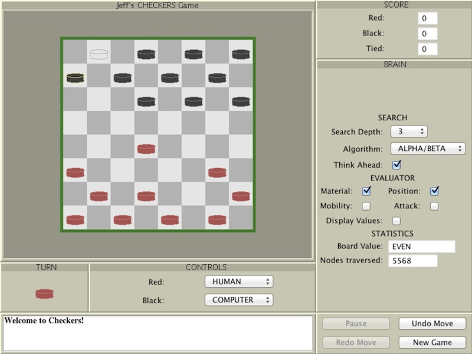

Checkers
===========

Checkers is a Java applet that I wrote years ago.  It appears here as an Eclipse project.

Loading the page "src/Checkers.html" within a browser should (maybe) start the program.
Failing that, from a command line you can try "appletviewer src/Checkers.html".

